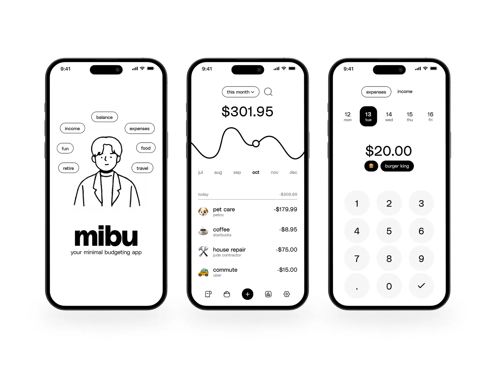

# Bootstrap the project stack

As a developer, I want the project scaffolded with a working stack, so that I can build features following the conventions already committed to in CLAUDE.md (tests, typecheck, lint, pre-commit hooks, CI).

## Context

The repo is currently an empty template (CLAUDE.md and skills only, no application code). CLAUDE.md already commits to `npm test`, `npm run typecheck`, `npm run lint`, colocated `*.test.*` files, and a pre-commit hook wired to CI — but none of this exists yet. This story bootstraps the actual codebase (React + Firebase) and basic auth wiring so the feature stories (household/invite, add-expense, edit-delete-expense) have a stack to build on.

## Acceptance criteria

- [ ] A React app is scaffolded with Vite in the repo root (single app, no monorepo/workspaces split).
- [ ] TypeScript is configured in `strict` mode for the app.
- [ ] TanStack React Query is configured (`QueryClientProvider` wired up at the app root) as the data-fetching/caching layer for all Firestore reads and writes.
- [ ] shadcn/ui is set up (Tailwind CSS + `components.json` + the shadcn CLI) as the component library, with its color/typography theme customized to match the visual style described below rather than left at shadcn's default look.
- [ ] Vitest and React Testing Library are configured; a trivial colocated test (`*.test.*` next to a sample component) runs via `npm test` and passes.
- [ ] `npm run typecheck` runs the TypeScript compiler in check-only mode and passes on the scaffold.
- [ ] ESLint (with `@typescript-eslint/recommended` and `eslint-plugin-react-hooks`) and Prettier are configured; `npm run lint` runs and passes on the scaffold.
- [ ] A new Firebase project is created (manual step — requires a Firebase/Google Cloud account with access to create/pay for a project) and connected to the app via environment variables (`.env` for local dev, documented in the README, with `.env` gitignored and an `.env.example` committed).
- [ ] Firebase Auth is enabled for the project with email/password and Google as sign-in providers. Enabling Google requires creating an OAuth client in Google Cloud Console and adding the app's domain to Firebase authorized domains (manual step — requires Google Cloud Console access); this story only covers provider configuration, not application-level login/signup UI.
- [ ] A typed Firebase client wrapper (e.g. `src/lib/firebase.ts`) is added as a shared module that the feature stories will import, initialized from the environment variables above. The client exposes Auth and Firestore.
- [ ] Unit tests do not depend on a real Firebase connection: the Firebase client is mockable/injectable in tests (e.g. via a test double), so `npm test` in CI never needs real Firebase credentials or network access.
- [ ] Husky + lint-staged are configured so a pre-commit hook runs ESLint and Prettier on staged files, and runs the full `npm run typecheck` and `npm test` across the project, blocking the commit if any fail.
- [ ] A GitHub Actions workflow runs `npm run typecheck`, `npm run lint`, and `npm test` on every pull request and on every push to `main` and `dev`, and fails the build if any of them fail. Since tests don't need real Firebase credentials, no Firebase secrets need to be configured in GitHub Actions for this story.
- [ ] Firestore security rules are explicitly out of scope here and will be defined alongside each collection's schema in the household and expense feature stories (there are no business collections yet for rules to apply to).
- [ ] The README documents how to run the app locally, run the test/lint/typecheck commands, and set up the required environment variables.

## Visual style reference

The screens above (a mock budgeting app called "mibu") set the visual direction for the whole product going forward — new UI built in this and later stories should read as the same design system:

- **Monochrome, near black-and-white palette.** Backgrounds are white; primary text, icons, and filled controls are black. Color is reserved for small accents (emoji icons, tiny highlights) rather than UI chrome.
- **Pill-shaped, outlined controls.** Buttons, filters, and tags are fully rounded (stadium/pill shape) with a thin black outline and white fill by default; the active/selected or primary state inverts to a solid black pill with white text (e.g. the selected day, the "+" add button, the selected category chip).
- **Bold, oversized numerals for the key figure.** The most important number on a screen (balance, amount) is set much larger and bolder than everything else, in a plain sans-serif — it should visually anchor the screen at a glance.
- **Small, muted secondary text.** Labels like dates, merchant names, or captions are small, gray/muted, and sit tightly under or beside their primary label rather than competing with it.
- **Hand-drawn, single-line illustration accents.** Where an illustration is used (e.g. the onboarding character), it's a simple black-outline line drawing with no fill or shading — playful but minimal, not a stock icon.
- **Generous whitespace and flat layout.** No shadows, gradients, or card borders beyond the pill controls themselves; content is separated by spacing and thin hairline dividers, not boxes.
- **Emoji as category icons.** List items (expenses) use a plain emoji as the leading icon rather than a custom icon set, paired with a bold item name and muted subtitle.
- Overall tone: minimal, confident, slightly playful — a calculator-app simplicity applied to budgeting.

When implementing shadcn/ui components in this and future stories, theme tokens (border radius, colors, font weights) should be adjusted to match this reference rather than using shadcn's default styling out of the box.

## Out of scope

- Database schema for `households`, `expenses`, or any other collection (created in their respective feature stories).
- Application-level login/signup UI and the full onboarding flow (covered by create-household-and-invite).
- Any feature UI beyond the scaffold (e.g. no household or expense screens).
- Local Firebase emulators (developers connect to the hosted project for now).
- Deployment/hosting setup for the frontend (e.g. Vercel/Netlify config).
- Firestore security rules (defined per-collection in the feature stories that create those collections).
- Running tests/CI against a real Firebase project (tests use a mocked/injectable client instead).

## Open questions

- None outstanding.
